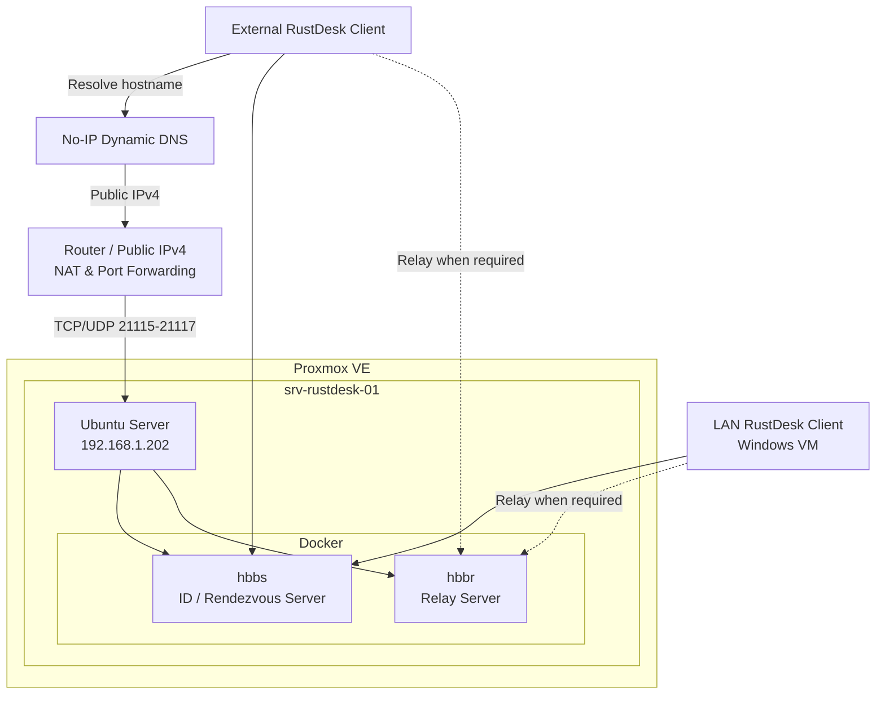

# Self-Hosted RustDesk Homelab

A self-hosted remote access infrastructure built with **RustDesk Server OSS**, **Docker**, and **Ubuntu Server**, running inside a **Proxmox VE homelab**.

The environment was deployed and tested both inside the local network and from an external network using **Dynamic DNS**, **NAT/Port Forwarding**, and a dedicated host firewall.

## Architecture



## Tech Stack

* Proxmox VE
* Ubuntu Server
* Docker Engine
* Docker Compose
* RustDesk Server OSS
* UFW
* No-IP Dynamic DNS
* NAT / Port Forwarding
* OpenSSH

## Infrastructure

The RustDesk server runs on a dedicated Ubuntu Server virtual machine hosted by Proxmox VE.

| Resource | Configuration     |
| -------- | ----------------- |
| VM       | `srv-rustdesk-01` |
| Hostname | `rustdesk01`      |
| vCPU     | 2                 |
| Memory   | 2 GB              |
| Disk     | 20 GB             |
| Network  | VirtIO            |
| LAN IP   | `192.168.1.202`   |

The application files are stored under:

```bash
/opt/rustdesk
```

## RustDesk Services

RustDesk Server OSS uses two main services.

### hbbs

`hbbs` provides the ID, rendezvous, and signaling services used by RustDesk clients to register and locate each other.

### hbbr

`hbbr` provides relay functionality when a direct peer-to-peer connection cannot be established between two RustDesk clients.

```text
Client A ──────► hbbs ◄────── Client B
                    │
             Connection setup
                    │
                    ▼
        Direct connection when possible
```

If a direct connection cannot be established:

```text
Client A ──────► hbbr ──────► Client B
                 Relay
```

## Docker Deployment

The RustDesk services are deployed using Docker Compose.

```yaml
services:
  hbbs:
    container_name: hbbs
    image: rustdesk/rustdesk-server:latest
    command: hbbs
    volumes:
      - ./data:/root
    network_mode: "host"
    depends_on:
      - hbbr
    restart: unless-stopped

  hbbr:
    container_name: hbbr
    image: rustdesk/rustdesk-server:latest
    command: hbbr
    volumes:
      - ./data:/root
    network_mode: "host"
    restart: unless-stopped
```

Start the services:

```bash
cd /opt/rustdesk
docker compose up -d
```

Check the containers:

```bash
docker compose ps
```

View logs:

```bash
docker logs -f hbbs
```

```bash
docker logs -f hbbr
```

## Persistent Data

RustDesk server data is persisted outside the container lifecycle:

```text
/opt/rustdesk/data
```

This directory contains the server configuration and cryptographic keys.

The private server key must never be committed to the repository.

```text
id_ed25519       -> PRIVATE KEY - DO NOT COMMIT
id_ed25519.pub   -> Public key used by RustDesk clients
```

## Network Configuration

Only the ports required by the RustDesk Server OSS deployment are exposed.

| Port  | Protocol | Purpose                     |
| ----- | -------- | --------------------------- |
| 21115 | TCP      | NAT type test               |
| 21116 | TCP      | Connection / hole punching  |
| 21116 | UDP      | ID registration / heartbeat |
| 21117 | TCP      | Relay server                |

The router forwards these ports to:

```text
192.168.1.202
```

Architecture:

```text
Internet
    |
    v
Public IPv4
    |
    v
Router
    |
    | NAT / Port Forward
    |
    v
192.168.1.202
    |
    +-- hbbs
    |
    +-- hbbr
```

## Dynamic DNS

The Internet connection uses a dynamic public IPv4 address.

To avoid configuring RustDesk clients with an IP address that may change, **No-IP Dynamic DNS** is used.

```text
RustDesk Client
      |
      v
example.ddns.net
      |
      v
No-IP
      |
      v
Current Public IPv4
      |
      v
Router
```

The No-IP Dynamic Update Client runs as a systemd service on the Ubuntu server.

Check its status:

```bash
sudo systemctl status noip-duc
```

The service is enabled to start automatically during boot.

> The real DDNS hostname and authentication credentials are intentionally not included in this repository.

## Firewall

UFW is enabled on the Ubuntu server.

The RustDesk ports are publicly accessible:

```text
21115/TCP
21116/TCP
21116/UDP
21117/TCP
```

SSH access is restricted to the internal network.

```text
192.168.1.0/24 -> TCP/22
```

This keeps the management interface unavailable directly from the Internet.

## Security Considerations

The deployment follows several basic security practices:

* Dedicated VM for the RustDesk service
* Host firewall enabled
* Only required RustDesk ports exposed
* SSH restricted to the LAN
* Private keys excluded from version control
* DDNS credentials excluded from version control
* Persistent application data separated from containers
* No unnecessary web-client ports exposed

Sensitive information should never be committed to Git, including:

```text
Private keys
Passwords
DDNS credentials
API tokens
Public management addresses
```

## Validation

### Local Network Test

Two RustDesk clients inside the LAN were configured to use the self-hosted server.

```text
Client A
   |
   v
192.168.1.202
hbbs / hbbr
   ^
   |
Client B
```

Both clients successfully registered with the server and a remote session was established.

### External Network Test

A second test was performed with the notebook connected to an external Internet connection instead of the homelab LAN.

```text
External Notebook
       |
       v
   No-IP DDNS
       |
       v
   Public IPv4
       |
       v
      NAT
       |
       v
RustDesk Server
192.168.1.202
       |
       v
Windows VM
```

The external client successfully reached the self-hosted `hbbs` server and established a RustDesk remote session with the Windows VM inside the homelab.

The external TCP connection to `hbbs` was also validated directly on Linux using:

```bash
sudo ss -tnp | grep -E '21115|21116|21117'
```

Example:

```text
ESTAB ... 192.168.1.202:21116 ... EXTERNAL_IP:PORT ... hbbs
```

This confirmed that the external RustDesk client was communicating with the self-hosted infrastructure.

## Troubleshooting

### Key Mismatch

During the initial client configuration, one RustDesk client returned a key mismatch error.

#### Cause

The client was configured with a public key that did not match the key generated by the current `hbbs` server.

#### Verification

The correct public key can be checked on the server:

```bash
cat /opt/rustdesk/data/id_ed25519.pub
```

#### Solution

Both RustDesk clients were configured using the same public key generated by the self-hosted server.

---

### Docker Compose Configuration Not Found

Running:

```bash
docker compose ps
```

outside the RustDesk project directory returned:

```text
no configuration file provided: not found
```

#### Cause

Docker Compose searches for the Compose configuration file in the current working directory.

#### Solution

Change to the project directory:

```bash
cd /opt/rustdesk
docker compose ps
```

Or explicitly specify the file:

```bash
docker compose -f /opt/rustdesk/compose.yml ps
```

## Service Recovery Test

The Ubuntu VM was rebooted to verify that the infrastructure could recover automatically.

After reboot:

* Docker started successfully
* `hbbs` started automatically
* `hbbr` started automatically
* No-IP DUC started automatically
* Dynamic DNS resolution continued working

This validated that the basic remote access infrastructure does not require manual service startup after a reboot.

## Repository Structure

```text
rustdesk-homelab/
|
├── README.md
├── compose.yml
├── .gitignore
|
├── docs/
|   ├── networking.md
|   ├── security.md
|   └── troubleshooting.md
|
└── images/
    ├── docker-containers.png
    └── external-test.png
```

## Roadmap

* [x] Dedicated Ubuntu Server VM
* [x] Docker Engine
* [x] Docker Compose deployment
* [x] RustDesk `hbbs`
* [x] RustDesk `hbbr`
* [x] Persistent server data
* [x] Local network test
* [x] UFW firewall
* [x] Dynamic DNS
* [x] NAT / Port Forwarding
* [x] External network test
* [x] Automatic startup after reboot
* [ ] Service monitoring
* [ ] Automated backups
* [ ] Infrastructure automation with Ansible

## Lessons Learned

This project provided practical experience with:

* Self-hosted services
* Linux service administration
* Docker container deployment
* Persistent container storage
* TCP/UDP network services
* NAT and port forwarding
* Dynamic DNS
* Linux firewall configuration
* systemd services
* Remote access infrastructure
* Network troubleshooting
* Service validation using Linux networking tools

## Disclaimer

This repository documents a personal homelab environment.

Public hostnames, credentials, private keys, and other sensitive infrastructure information have been removed or replaced with example values.
